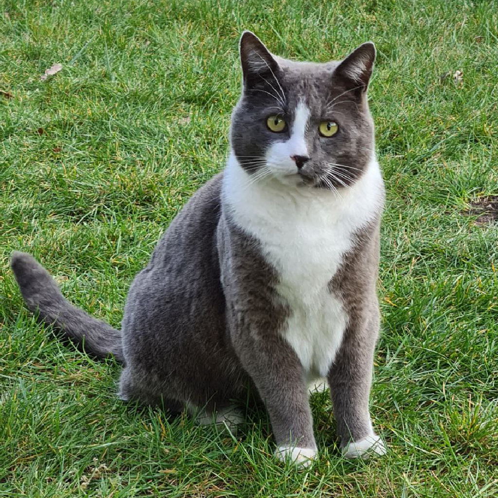
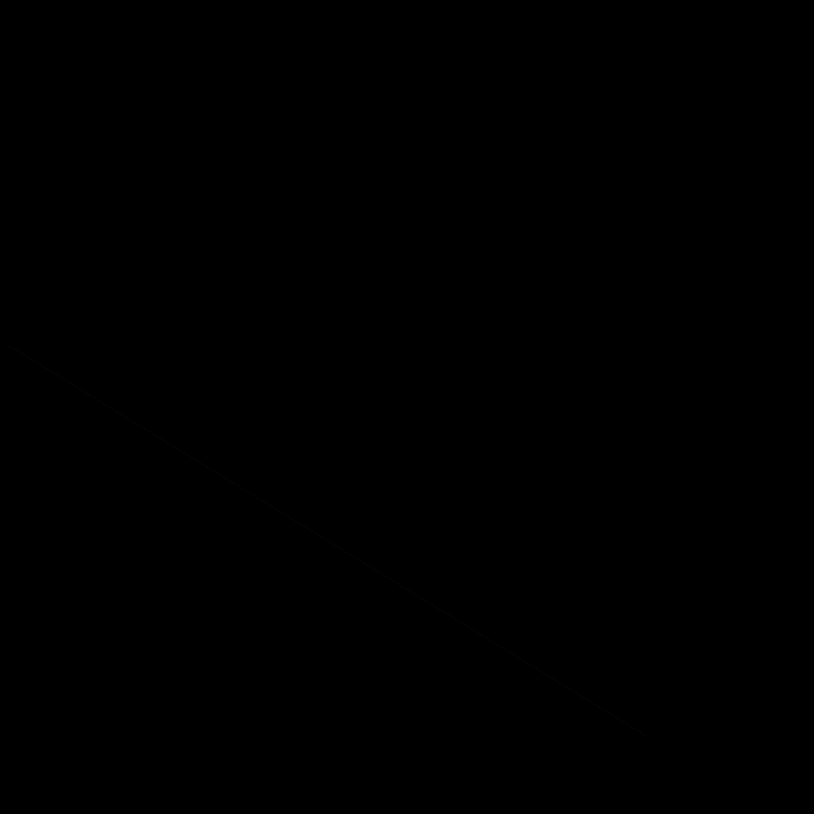
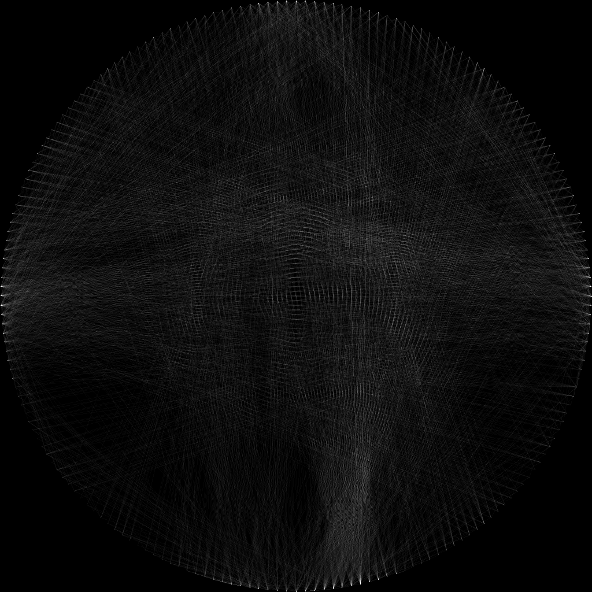
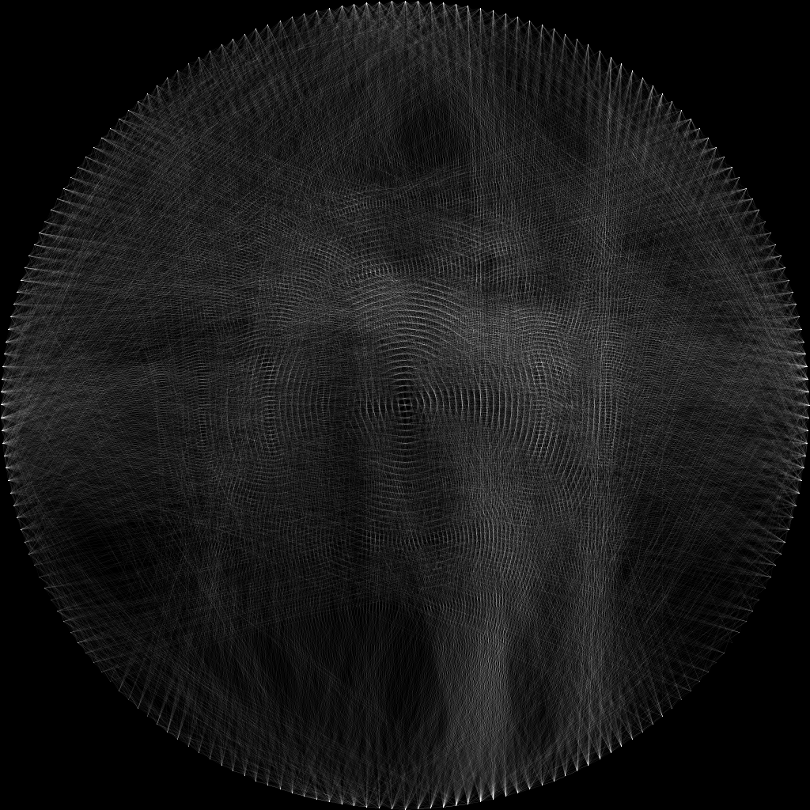
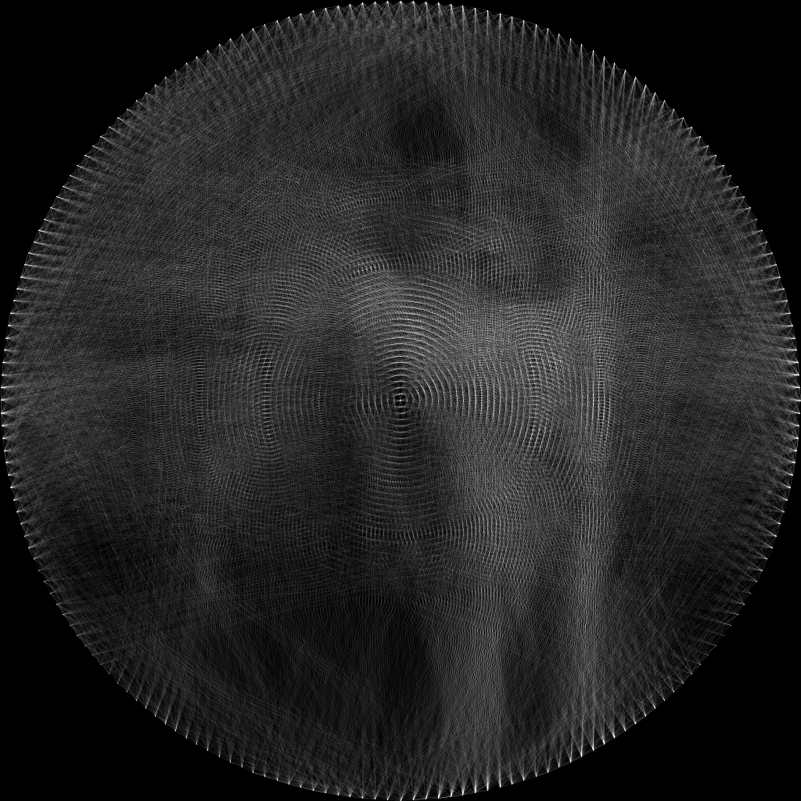
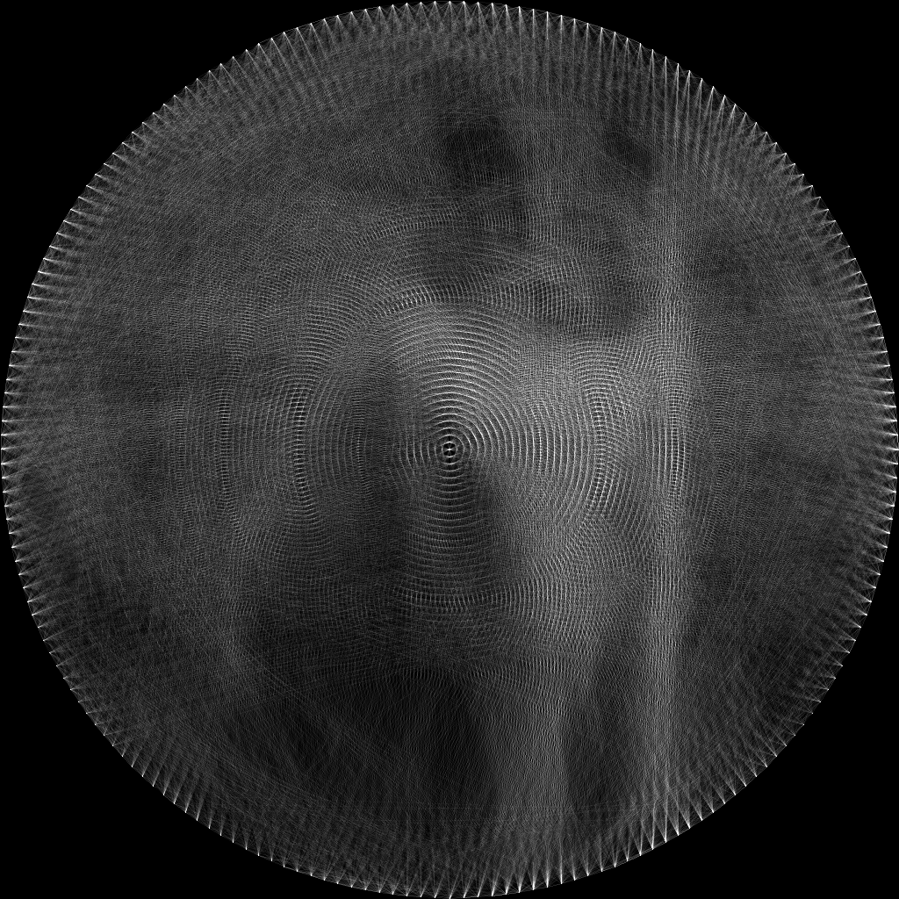
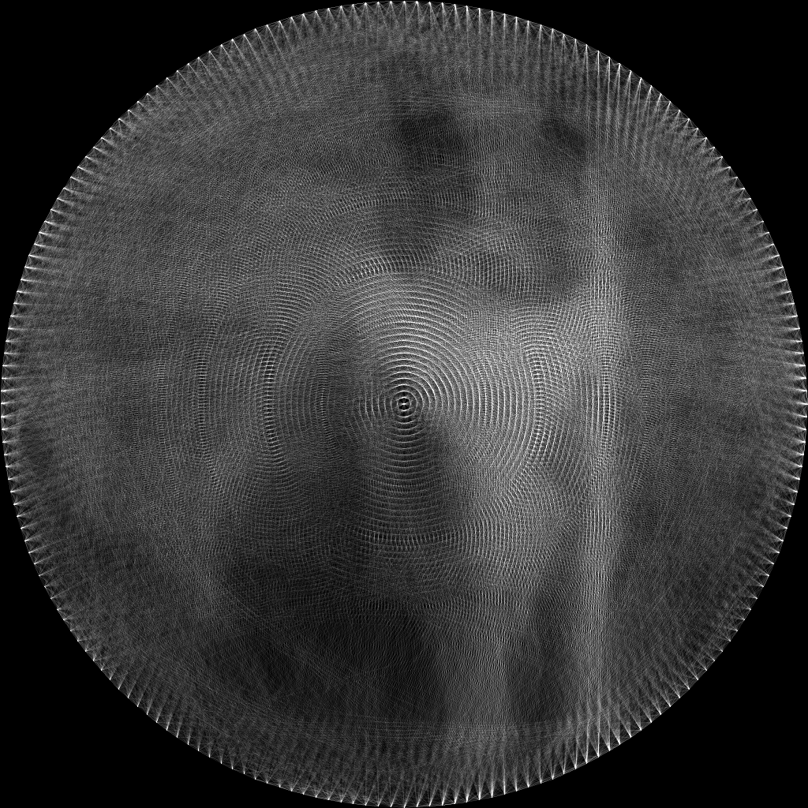
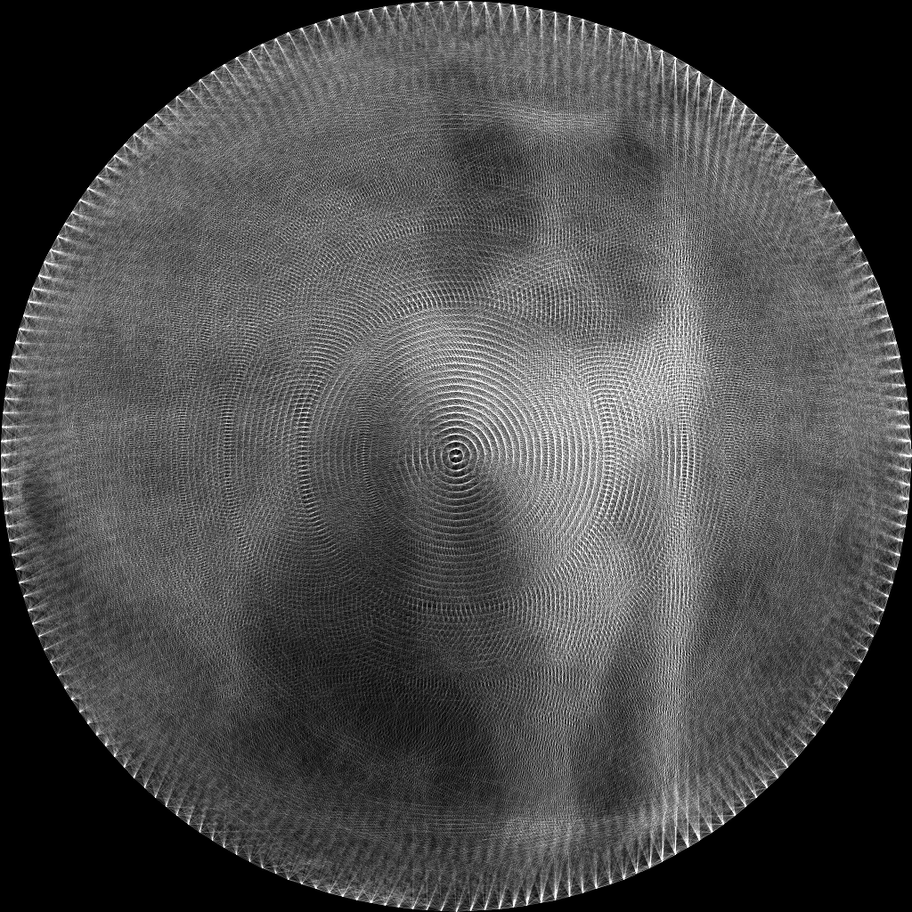

# Line Art Generator

A Python-based computational art tool that transforms standard images into intricate **String Art** designs. By simulating a single, semi-transparent thread stretched between pins arranged in a circle, this script iteratively reconstructs your image through thousands of overlapping lines.

Basically, Imagine having one very long, semi-transparent string and a circular loom. By passing that string back and forth, you can recreate any image. This script does exactly that in the digital realm.


## 📸 Sample Output
<p align="center">
  
  
  
  
  <br/>
  
  
  
  
    
</p>

> **Note on Grayscale Processing**: This tool currently operates in grayscale. By default, it extracts the Red channel (channel 0) from your source PNG to create a luminance map. The final output is a monochromatic representation of the original image based on string density.
---

## 🚀 Getting Started

This project uses [uv](https://github.com/astral-sh/uv) for extremely fast Python package and project management.

### Prerequisites

* Python 3.10+
* `uv` installed on your system.

### Installation

1. **Clone the repository:**
```bash
git clone https://github.com/verbeemen/line-art.git 
cd line-art
```


2. **Run the project:**
You don't need to manually create a virtual environment. `uv` will handle it for you based on the dependencies:

```bash
uv run main.py
```

---

## ⚙️ How it Works

The algorithm follows a "greedy" heuristic approach to recreate the target image:

1. **Circular Loom:** It places  pins (points) evenly around a circular boundary.
2. **Pre-computation:** It calculates the path (using **Bresenham's line algorithm**) between every possible pair of pins.
3. **Iterative Selection:** * Starting from a random pin, it looks at all possible next pins.
* It calculates which line, if drawn, would make the current canvas look **most like** the original image.
* The "best" line is drawn, and the process repeats from the new pin.


4. **Transparency:** Each "string" has a low intensity (semi-transparency), allowing details to emerge only through multiple overlapping layers.

---

## 🛠 Configuration

You can tweak the constants at the top of `circle_line_art.py` to change the artistic style:

| Parameter | Description |
| --- | --- |
| `N` | Number of pins around the circle (e.g., 200). More pins = higher detail. |
| `SKIP_RANGE` | Prevents the string from moving to a pin too close to the current one. |
| `INTENSITY` | The "weight" or darkness of a single string pass. |
| `IMAGE_NAME` | The source filename located in your input directory. |
| `INVERT_COLOUR` | Set to `True` if you want to draw with white string on a black background. |

---

## 📂 Project Structure

* `line_art/circle_line_art.py`: The core logic for image processing and line selection.
* `line_art/config.py`: Handles directory paths for input and output.
* `input/`: Place your source `.png` files here.
* `output/`: Where the intermediate and final renders are saved.

---

## 📝 Future Ideas

* **Performance:** Implement line-score caching to speed up iterations.
* **Global Search:** Move beyond a "greedy" local search for more optimal line placement.
* **Shape Variations:** Experiment with different pin arrangements (e.g., grids, spirals).
